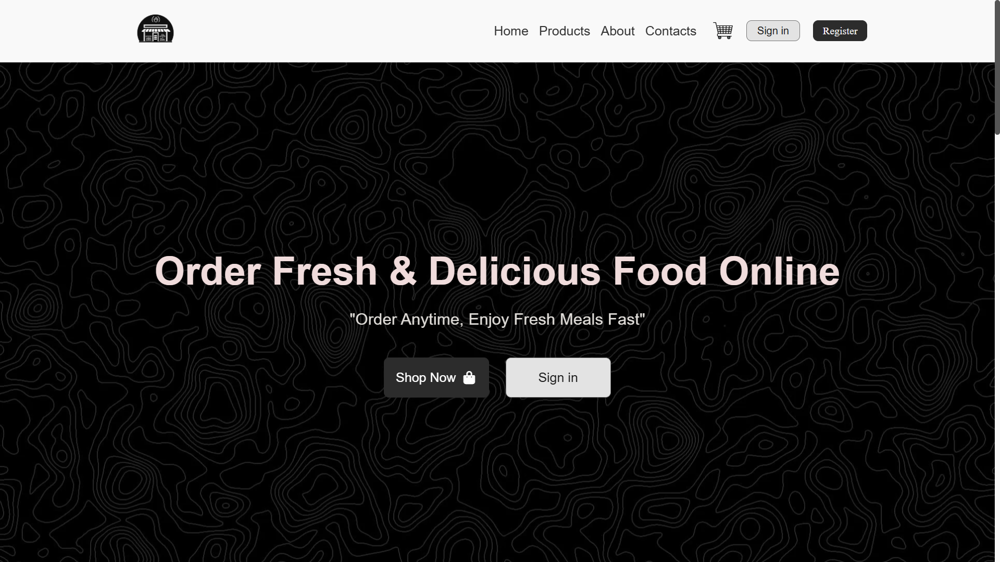
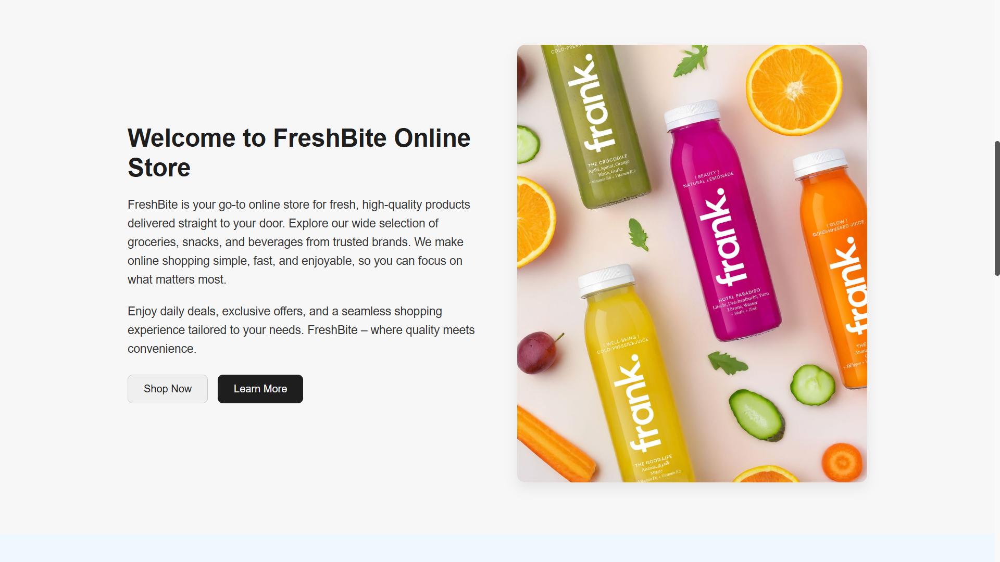
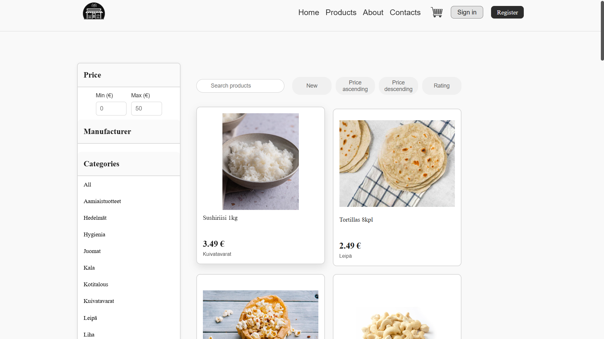
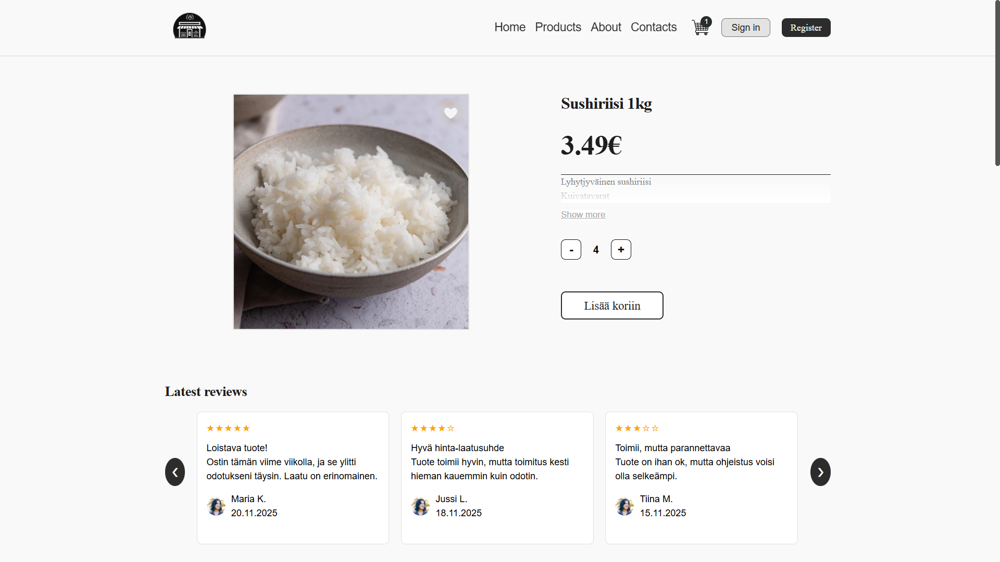
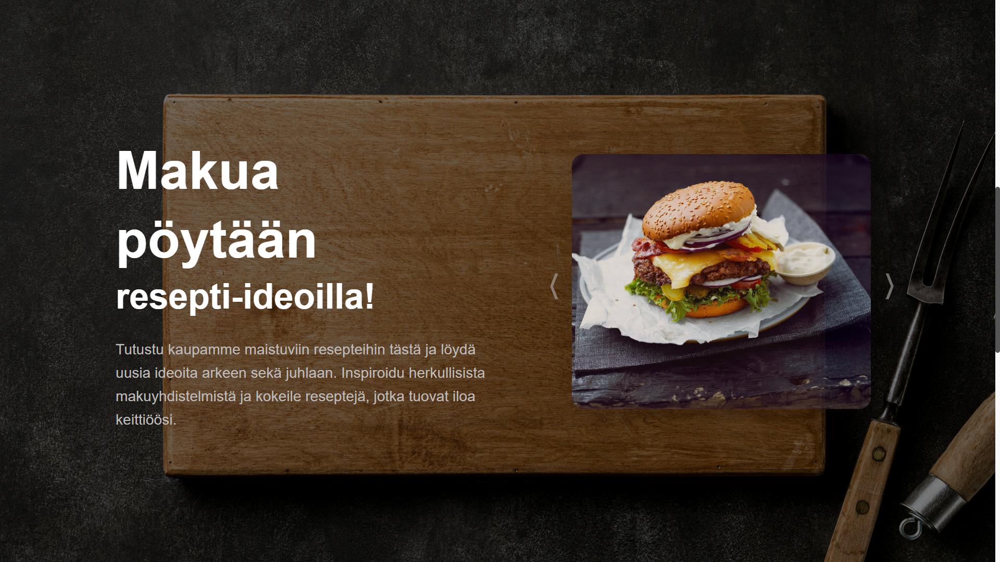
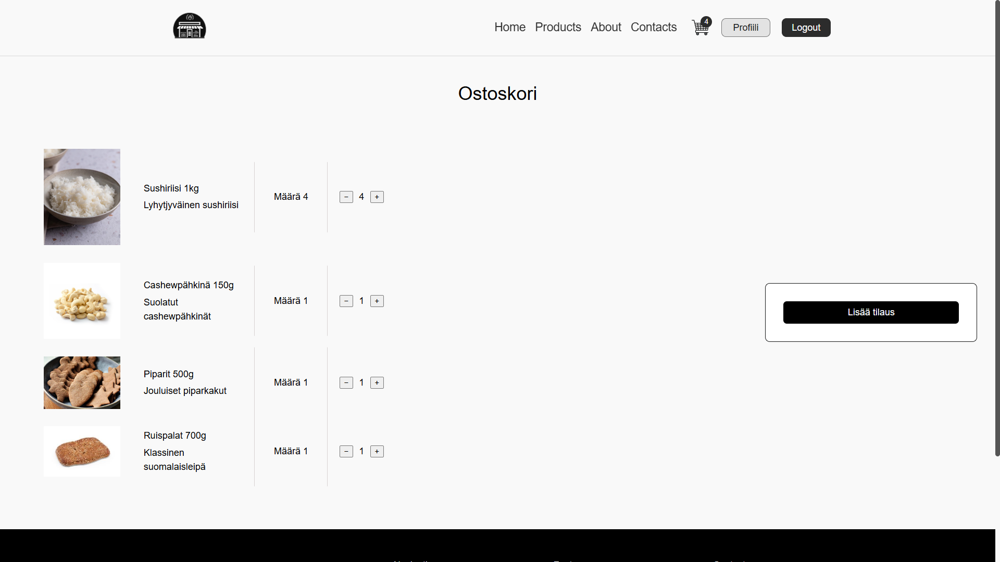
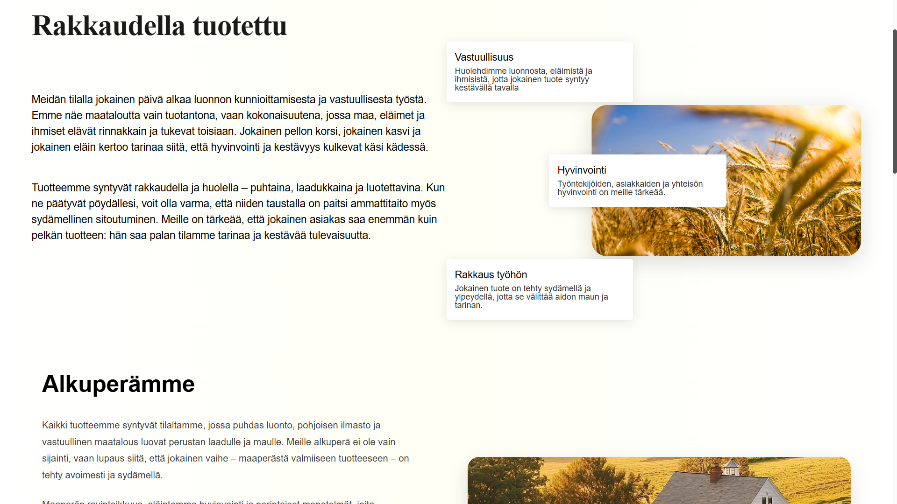

# Taitaja24 Semifinal - E-Commerce Web Application

## 📋 Project Overview

This repository contains a full-stack e-commerce web application (verkkokauppa) based on the Taitaja 2024 competition semifinals project. The project is built with Laravel and demonstrates modern web development practices, including user authentication, shopping cart functionality, product management, and administrative features.

## NOTE!
Some of the parts of the code might break because there are urls and other parts of codes which are hardcoded (oops🤦). But we are still proud of what we came up with and we really learned a lot. Images of the project you can view at the bottom of THIS ReadME. 

## 👥 Team Members (Tekijät)

- Risto Toivanen (ME) -Fullstack and backend coder of the project
- Daria Velychko -Frontend and Ui desing
- Danyil Velychko -Frontend and Ui desing

## 🛠️ Technologies Used

- **Laravel 11** - Modern PHP framework
- **PHP 8.2+** - Backend programming language
- **Livewire** - Dynamic frontend components
- **Blade** - Laravel templating engine
- **MySQL** - Database management
- **CSS3** - Custom styling and responsive design
- **JavaScript** - Client-side interactivity
- **Docker** - Containerization and deployment
- **Composer** - PHP dependency management

## ✨ Key Features

### User Features
- 🔐 User authentication (login/register)
- 📧 Email verification
- 🔒 Two-factor authentication (2FA)
- 👤 User profile management
- 🔑 Password reset functionality
- ✉️ Email change with verification
- 🛒 Shopping cart system
- 📦 Order placement and tracking
- 📍 Address management

### Admin Features
- 📊 Admin dashboard
- 🏪 Product management (CRUD operations)
- 📂 Category management
- 👥 User management
- 📝 Recipe management (Reseptit)
- 📈 Order monitoring

### Technical Features
- 📱 Responsive design for all devices
- 🔄 Real-time updates with Livewire
- 🛡️ Security features (CSRF protection, password hashing)
- 📬 Email notifications
- 🗃️ Database migrations and seeders
- 🧪 Unit and feature testing support
- 🐳 Docker support for easy deployment

## 📁 Project Structure

```
projekti/
├── app/
│   ├── Http/
│   │   ├── Controllers/        # Application controllers
│   │   │   ├── AuthController.php
│   │   │   ├── CartController.php
│   │   │   ├── ProductsController.php
│   │   │   └── ...
│   │   └── Middleware/         # Custom middleware
│   ├── Livewire/              # Livewire components
│   ├── Models/                # Eloquent models
│   ├── Notifications/         # Email notifications
│   └── Providers/             # Service providers
├── bootstrap/                 # Framework bootstrap files
├── config/                    # Configuration files
├── database/
│   ├── migrations/           # Database migrations
│   ├── seeders/              # Database seeders
│   └── factories/            # Model factories
├── docker/                    # Docker configuration
├── public/
│   ├── css/                  # Stylesheets
│   ├── js/                   # JavaScript files
│   ├── images/               # Image assets
│   └── index.php             # Application entry point
├── resources/
│   └── views/                # Blade templates
│       ├── auth/             # Authentication views
│       ├── layouts/          # Layout templates
│       ├── livewire/         # Livewire component views
│       └── partials/         # Reusable view components
├── routes/
│   ├── web.php               # Web routes
│   ├── api.php               # API routes
│   └── console.php           # Console commands
├── storage/                   # Application storage
├── tests/                     # Unit and feature tests
├── .env.example              # Environment variables template
├── artisan                    # Laravel CLI tool
├── composer.json             # PHP dependencies
├── docker-compose.yml        # Docker compose configuration
├── package.json              # NPM dependencies
└── verkkokauppa.sql          # Database dump
```

## 🚀 Getting Started

### Prerequisites

- PHP 8.2 or higher
- Composer
- MySQL 8.0 or higher
- Node.js & NPM (for frontend assets)
- Docker & Docker Compose (optional, for containerized setup)

### Installation (Traditional Setup)

1. **Clone the repository:**
```bash
git clone https://github.com/RistoT1/Taitaja24-semifinaali-GroupProject.git
cd Taitaja24-semifinaali-GroupProject/projekti
```

2. **Install PHP dependencies:**
```bash
composer install
```

3. **Install NPM dependencies:**
```bash
npm install
```

4. **Configure environment:**
```bash
cp .env.example .env
```

Edit `.env` and configure your database connection:
```env
DB_CONNECTION=mysql
DB_HOST=127.0.0.1
DB_PORT=3306
DB_DATABASE=verkkokauppa
DB_USERNAME=your_username
DB_PASSWORD=your_password
```

5. **Generate application key:**
```bash
php artisan key:generate
```

6. **Import the database:**
```bash
mysql -u your_username -p verkkokauppa < verkkokauppa.sql
```

Or run migrations:
```bash
php artisan migrate
```

7. **Seed the database (optional):**
```bash
php artisan db:seed
```

8. **Build frontend assets:**
```bash
npm run build
```

9. **Start the development server:**
```bash
php artisan serve
```

10. **Access the application:**
```
http://localhost:8000
```

### Installation (Docker Setup)

#### Development Environment (with phpMyAdmin)

1. **Clone the repository:**
```bash
git clone https://github.com/RistoT1/Taitaja24-semifinaali-GroupProject.git
cd Taitaja24-semifinaali-GroupProject/projekti
```

2. **Asign Env**
```bash
-mailer configs and db confs
```

3. **Start Docker containers with development profile:**
```bash
docker-compose --profile dev up -d
```

4. **Setup database in port 8081**
```bash
(http://localhost:8081/)
Create new database named verkkokauppa
then import the database.

After this might have to do
docker-compose down
docker ps -a --filter "network=projekti_laravel" --format "{{.ID}}"
 | ForEach-Object { docker rm -f $_ }
docker-compose down
```

5. **Install dependencies inside container: (usually don't need to do this)**
```bash
docker-compose exec app composer install
docker-compose exec app npm install
```

6. **Configure environment and run migrations: (usually don't need to do this**
```bash
docker-compose exec app cp .env.example .env
docker-compose exec app php artisan key:generate
docker-compose exec app php artisan migrate
```

7. **Access the application:**
   - **Laravel Application:** http://localhost:8080
   - **phpMyAdmin:** http://localhost:8081 (username: `root`, password: `rootpassword`)
   - **MySQL:** localhost:3307

#### Production Environment (secure, no phpMyAdmin)

For production deployment without development tools:

```bash
# Start production environment
docker-compose -f docker-compose.yml up -d

# Stop production environment
docker-compose -f docker-compose.yml down
```

**Key Production Differences:**
- phpMyAdmin is disabled for security
- Debug mode is off
- Optimized file mounting (only .env and storage)
- Production-ready configuration

## 💻 Development

### Docker Management

#### Common Docker Commands

```bash
# Start development environment (with phpMyAdmin)
docker-compose --profile dev up -d

# Stop containers
docker-compose down

# View real-time logs
docker-compose logs -f

# View logs for specific service
docker-compose logs -f app

# Access container shell
docker-compose exec app bash

# Restart services after code changes
docker-compose restart app

# Rebuild containers (after Dockerfile changes)
docker-compose up -d --build

# Clear Laravel cache after code changes
docker-compose exec app php artisan optimize:clear

# Remove everything including volumes (⚠️ DESTRUCTIVE - deletes database data)
docker-compose down -v

# Clean up stopped containers
docker ps -a --filter "network=projekti_laravel" --format "{{.ID}}" | ForEach-Object { docker rm -f $_ }
```

#### Running Artisan Commands in Docker

```bash
# Run migrations
docker-compose exec app php artisan migrate

# Clear caches
docker-compose exec app php artisan cache:clear
docker-compose exec app php artisan config:clear
docker-compose exec app php artisan view:clear

# Create controllers, models, etc.
docker-compose exec app php artisan make:controller ControllerName
docker-compose exec app php artisan make:model ModelName -m

# Run database seeders
docker-compose exec app php artisan db:seed
```

#### Troubleshooting Docker

**Port already in use:**
```bash
# Check what's using the port (Windows)
netstat -ano | findstr :8080

# Check what's using the port (Linux/Mac)
lsof -i :8080

# Kill the process or change ports in docker-compose.yml
```

**Permission issues:**
```bash
# Fix storage and cache permissions
docker-compose exec app chmod -R 775 storage bootstrap/cache
docker-compose exec app chown -R www-data:www-data storage bootstrap/cache
```

**Database connection issues:**
```bash
# Verify MySQL is running
docker-compose ps

# Check MySQL logs
docker-compose logs db

# Restart database
docker-compose restart db
```

**Clear everything and start fresh:**
```bash
# Stop and remove all containers, networks, and volumes
docker-compose down -v

# Remove all images (optional, forces rebuild)
docker-compose down --rmi all

# Start fresh
docker-compose --profile dev up -d --build
```

#### Environment Comparison

| Feature | Development (`--profile dev`) | Production (default) |
|---------|-------------------------------|----------------------|
| **Code changes** | Auto-reload with volume mounts | Requires container rebuild |
| **phpMyAdmin** | ✅ Enabled on port 8081 | ❌ Disabled for security |
| **Debug mode** | ✅ APP_DEBUG=true | ❌ APP_DEBUG=false |
| **File mounts** | Full source code directory | Only .env + storage |
| **Performance** | Slightly slower (volume overhead) | Optimized for speed |
| **Security** | Development-friendly | Production-hardened |

### Running Tests

```bash
# Traditional setup
php artisan test

# Docker setup
docker-compose exec app php artisan test

# Run specific test suite
php artisan test --testsuite=Feature
php artisan test --testsuite=Unit

# Run with coverage (if phpunit/coverage is configured)
php artisan test --coverage
```

### Code Style

- Follow PSR-12 coding standards for PHP
- Use Laravel best practices
- Comment complex logic
- Write meaningful commit messages
- Use meaningful variable and function names

### Common Artisan Commands

```bash
# Clear application cache
php artisan cache:clear

# Clear configuration cache
php artisan config:clear

# Create a new controller
php artisan make:controller ControllerName

# Create a new model
php artisan make:model ModelName -m

# Create a new migration
php artisan make:migration create_table_name

# Run migrations
php artisan migrate

# Rollback migrations
php artisan migrate:rollback

# Create a Livewire component
php artisan make:livewire ComponentName
```

## 📝 Documentation

Additional project documentation can be found in:
- `/lisämateriaali/` - Supplementary materials and resources

## 🔒 Security

- All passwords are hashed using bcrypt
- CSRF protection on all forms
- SQL injection protection via Eloquent ORM
- XSS protection via Blade templating
- Two-factor authentication available
- Email verification for new accounts










